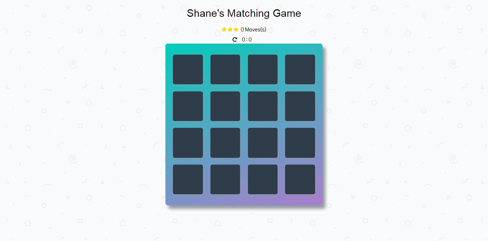

# Memory Game Project

A html, css and js game to test memory. Built as part of the Udacity FEND course.

## How to Load the Game

- Clone the repo and open index.html

## How to Play the Game

The game consists of 8 pairs of cards (16 cards total) arranged randomly in a grid.
The game begins when a player clicks on a card.
Each move consists of two guesses.
If the cards match they remain flipped over.
If they do not match the return to their original state.
The game is over when all cards are matched.
When the game is over a modal will appear alerting the player of their success, total number of moves, time taken and an option to restart.

For specific, detailed instructions, look at the project instructions in the [Udacity Classroom](https://classroom.udacity.com/me).

### Screenshot

## Contributing

This repository is the starter code for _all_ Udacity students. Therefore, we most likely will not accept pull requests.

For details, check out [CONTRIBUTING.md](CONTRIBUTING.md).

## Resources used to create the game:

- <https://www.freecodecamp.org/>
- <https://www.w3schools.com/>
- <https://inspirationalpixels.com/tutorials/custom-popup-modal#step-html>
- <http://www.developphp.com/video/JavaScript/Memory-Game-Programming-Tutorial>
